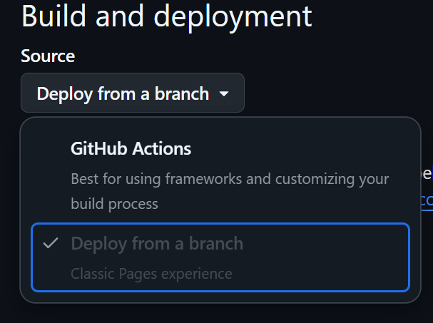

# AML Project: Welding Quality Prediction

## Project Description

This project focuses on predicting welding quality based on time-series data of electrical current and voltage measurements. The analysis employs various machine learning techniques to extract meaningful features from welding process data, identify patterns through clustering, and build predictive models for quality classification.

## Dataset Details

- **Source**: [Zenodo Welding Dataset](https://doi.org/10.5281/zenodo.15101072)
- **Content**: Current and voltage time series data from welding processes
- **Sampling**: Synchronously sampled at 100 kHz frequency with maximum permissible error of 0.5%
- **Size**: Approximately 362,034 samples
- **Structure**: Each sample contains 200 time steps of both current and voltage measurements (shape: [samples, 200, 2])

## Project Structure

### Part 1: Data Processing and Exploration
1. [**Data Loading and Preprocessing (ex_01)**](tasks/ex_01.md)
In this exercise, you will implement functions to load, preprocess, and prepare time-series welding data for machine learning analysis. You'll build the foundation for the entire project by creating data handling functions that will be used in subsequent exercises.

2. [**Data Visualization and Analysis (ex_02)**](tasks/ex_02.md)
   - Creating plots to understand data distribution
   - Generating tables of statistical properties
   - Visualizing time series characteristics

3. [**Feature Extraction (ex_03)**](tasks/ex_03.md)
   - Extracting meaningful features from time series
   - Statistical features (mean, std, min, max, median)
   - Frequency domain features (dominant frequencies)
   - Power-related features

4. [**Clustering Analysis (ex_04)**](tasks/ex_04.md)
   - Custom K-means implementation with multiple distance metrics
     - Euclidean, Manhattan, and DTW (Dynamic Time Warping)
   - Dimension reduction with PCA for visualization
   - Cluster analysis to identify patterns in welding data

### Part 2: Classification and Model Evaluation
1. [**Classification Models (ex_05)**](tasks/ex_05.md)
   - Implementation of Random Forest classifier
   - Feature importance analysis for quality prediction
   - Hyperparameter tuning

2. [**Model Comparison (ex_06)**](tasks/ex_06.md)
   - Evaluating different machine learning algorithms
   - Performance metrics analysis
   - Model selection based on accuracy and robustness

## Implementation Details

- **Programming Language**: Python
- **Key Libraries**: NumPy, Pandas, Scikit-learn, Matplotlib, Plotly, Seaborn
- **Custom Implementation**: K-means algorithm with multiple distance metrics
- **Interactive Visualization**: Web-based visualization for exploring welding data

## Setup and Installation

### Using uv (Fast Python Package Installer)

1. **Install uv**
   ```bash
   # On macOS/Linux
   curl -sSf https://astral.sh/uv/install.sh | bash

   # On Windows
   powershell -c "irm https://astral.sh/uv/install.ps1 | iex"
   ```

2. **Setup virtual environment and install dependencies**
   ```bash
   uv sync
   ```

3. **Activate the virtual environment**
   ```bash
   source .venv/bin/activate # On Linux/macOS
   .venv\Scripts\activate # On Windows
   ```

## Enable Github Pages

1. Go to the repository settings
2. Enable Github Pages
3. Click on Build and Deployment -> Source
4. Select Github Actions
5. The page will be published at https://{username}.github.io/{repository-name}

